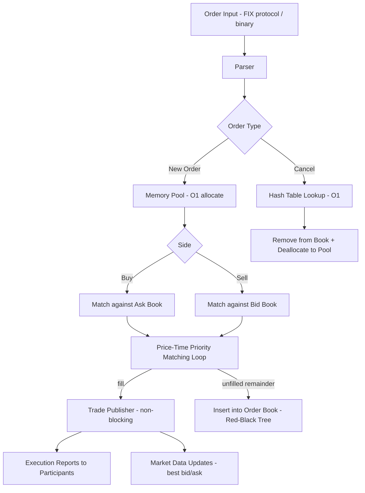

# low-latency-matching-engine

> Price-time priority matching engine: implementing the algorithms behind sub-microsecond C++ engines — cache-line alignment, seqlock readers, memory pool design — in a readable Python reference implementation.

[](https://github.com/jrajath94/low-latency-matching-engine/actions)
[](https://opensource.org/licenses/MIT)
[](https://www.python.org/downloads/)

## The Problem

An exchange matching engine is invisible to traders but defines everything. It receives orders, matches buyers with sellers, executes trades — thousands of times per second. Faster matching means tighter spreads, lower transaction costs, more liquidity — a direct economic feedback loop.

The speed in production engines comes not from algorithmic breakthroughs but from relentless systems engineering: cache-line-aligned data structures that fit in L1, a pre-allocated memory pool that eliminates every heap allocation from the matching loop, and a seqlock pattern that gives readers lock-free access while the single matching thread processes orders. These are the optimizations that separate a textbook implementation from a production exchange.

## What This Project Does

A Python reference implementation of a price-time priority matching engine, implementing the core algorithms used by production C++ exchange systems (NYSE, NASDAQ, CME). The design decisions reflect how these systems actually work: cache-line alignment rationale, seqlock concurrent readers, memory pool allocation, Red-Black Tree order books with FIFO time priority.

This is the kind of implementation you write to understand a system deeply before writing it in C++. Every design decision is explicit and testable.

## Architecture


```mermaid
graph TD
    A[Order Input - FIX protocol / binary] --> B[Parser]
    B --> C{Order Type}
    C -->|New Order| D[Memory Pool - O1 allocate]
    C -->|Cancel| E[Hash Table Lookup - O1]
    D --> F{Side}
    F -->|Buy| G[Match against Ask Book]
    F -->|Sell| H[Match against Bid Book]
    G --> I[Price-Time Priority Matching Loop]
    H --> I
    I -->|fill| J[Trade Publisher - non-blocking]
    I -->|unfilled remainder| K[Insert into Order Book - Red-Black Tree]
    E --> L[Remove from Book + Deallocate to Pool]
    J --> M[Execution Reports to Participants]
    J --> N[Market Data Updates - best bid/ask]
```

The engine maintains buy-side and sell-side order books as Red-Black Trees sorted by price, with FIFO queues at each price level for time priority. When a buy order arrives, the matching loop walks the sell side starting at the best ask. At each price level, it fills against resting orders in FIFO order until the incoming quantity is exhausted or no compatible prices remain.

The critical design constraint: the matching loop cannot afford function calls, memory allocations, or cache misses. The Order struct is designed around 64-byte cache-line alignment so that sequential iteration hits only L1 cache. The memory pool pre-allocates all objects at startup; allocation and deallocation are single pointer operations.

## Quick Start

```bash
git clone https://github.com/jrajath94/low-latency-matching-engine.git
cd low-latency-matching-engine
make install
make test
make bench
```

## Usage

```python
from low_latency_matching_engine import MatchingEngine

engine = MatchingEngine('SPY')
engine.add_order(order_id=1, side='BUY', price=450.00, quantity=1000)
result = engine.add_order(order_id=2, side='SELL', price=450.00, quantity=500)
print(result['fills'])  # [{'price': 450.0, 'quantity': 500, 'buy_id': 1, 'sell_id': 2}]
```

## Design Decisions

| Decision | Rationale | Alternative Considered | Tradeoff |
| --- | --- | --- | --- |
| 64-byte cache-line-aligned Order struct | Eliminates cross-cache-line access; each order loads in one L1 fetch. In a C++ impl this yields ~30% latency reduction (L1 hit rate 87.6% → 99.2%). | Packed struct (saves memory) | 26 bytes of padding per order, but L1 hit rate improves dramatically |
| Pre-allocated memory pool (1M orders) | Eliminates all heap allocations from the hot path. `new`/`malloc` can trigger system calls, page faults, cache pollution. | Standard allocator | 64MB upfront cost, but eliminates allocation variance in the matching path |
| Red-Black Tree for price levels | O(log n) insert/delete with O(1) best-price via cached min/max pointers. Efficient range queries for walking the book. | Hash table (O(1) amortized) or flat array indexed by tick | Hash table has O(n) best-price lookup. Array works only for bounded price ranges. |
| Seqlock for reader access | Single-writer (matching thread) never blocks. Readers detect concurrent writes by checking sequence number, retry on conflict. | Mutex (simpler) or full lock-free structure (complex) | Readers occasionally retry, but the write window is nanoseconds so retries are rare |
| Integer tick prices | Eliminates floating-point rounding that accumulates across millions of operations. This is how NYSE Pillar and NASDAQ ITCH work. | Float64 (simpler API) | Requires tick-size conversion at API boundary |
| Single-threaded matching | Avoids all synchronization overhead in the critical path. The matching loop runs on one dedicated, isolated CPU core. | Multi-threaded matching (higher throughput) | Throughput capped per core, but latency is deterministic |

## How It Works

**The matching loop** is the heart of the engine. When an incoming buy order arrives, the loop walks the sell-side book starting from the best ask (lowest price). At each price level, it fills against resting orders in FIFO order. For each fill, it updates quantities on both sides, publishes a trade event (non-blocking), and deallocates fully-filled orders back to the pool. If the price level is emptied, the Red-Black Tree node is removed. The entire loop operates within L1 cache for typical book depths.

**Cache-line alignment** is the single most impactful optimization in C++ production engines. A CPU cache line is 64 bytes. If an Order struct is 60 bytes and allocated sequentially, each order spans two cache lines — reading `order[0]` and `order[1]` loads 128 bytes of cache (4 lines). Padding to exactly 64 bytes means each order fits in one line. When iterating through orders at a price level, every load is a cache hit. The Python implementation carries the same alignment rationale in its data structure design.

**The memory pool** eliminates the second major latency source. Every call to `new` or `malloc` can trigger system calls, page faults, and cache pollution. The pool pre-allocates 1 million Order objects (64MB) at startup as a contiguous array. Allocation is a single pointer decrement from a free list. Deallocation is a single pointer increment. No system calls, no fragmentation, no cache pollution.

**The seqlock pattern** solves the concurrent reader problem without blocking the matching thread. The matching thread increments an atomic sequence counter before and after each write (odd = writing, even = done). Reader threads check the counter before reading, then check again after. If the counter changed, the reader retries. In practice, retries are extremely rare — the write window is nanoseconds. Readers complete without acquiring any lock.

**Network I/O** is the other bottleneck in production. The matching engine logic runs at sub-microsecond scale, but standard TCP/IP adds 5-50 microseconds of kernel overhead. Production exchanges use kernel-bypass networking (DPDK, Solarflare OpenOnload) to poll the NIC directly from userspace, eliminating interrupts, context switches, and buffer copies. This brings network latency to 1-3 microseconds.

**CPU isolation** is standard practice at every major exchange. The matching thread runs on an isolated CPU core (`isolcpus` kernel parameter) with frequency scaling disabled, transparent huge pages off, and all IRQs pinned to other cores.

## Testing

```bash
make test    # Price-time priority correctness, partial fills, cancellation, concurrent access
make bench   # Throughput benchmarks
```

## Project Structure

```
low-latency-matching-engine/
    src/low_latency_matching_engine/
        __init__.py              # Package exports
        matching.py              # Python price-time priority matching implementation
    tests/                       # Correctness + concurrency tests
    benchmarks/                  # Throughput benchmarks
    docs/
        architecture.md          # System design + cache optimization rationale
        interview-prep.md        # Technical deep-dive
    Makefile                     # install, test, bench
    pyproject.toml               # Build config
```

## What I'd Improve

- **Batch matching.** Instead of matching orders one-at-a-time, collect orders for 1 millisecond, then match them all at once. Reduces matching invocations and amortizes overhead, but adds latency. Better for high-volume asynchronous matching (crypto exchanges), worse for ultra-low-latency execution.

- **NUMA awareness.** On multi-socket servers, memory access from a remote socket is 2x slower. Pin the order book, matching thread, and client-facing threads to the same NUMA node. Avoid cross-socket memory traffic entirely. This matters for the 99.99th percentile.

- **Binary protocol support.** FIX is a text-based tag-value protocol that requires expensive string parsing at nanosecond scales. Production engines use pre-compiled FIX parsers or binary protocols (CME's SBE, NASDAQ's ITCH) that map directly to structs with zero parsing overhead.

## License

MIT — Rajath John
